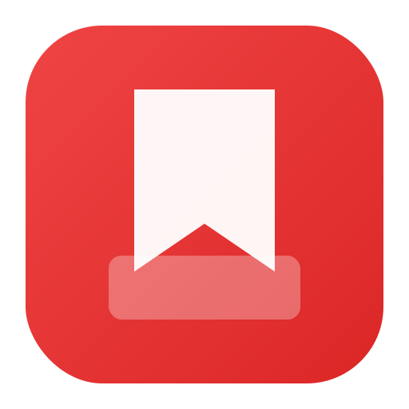
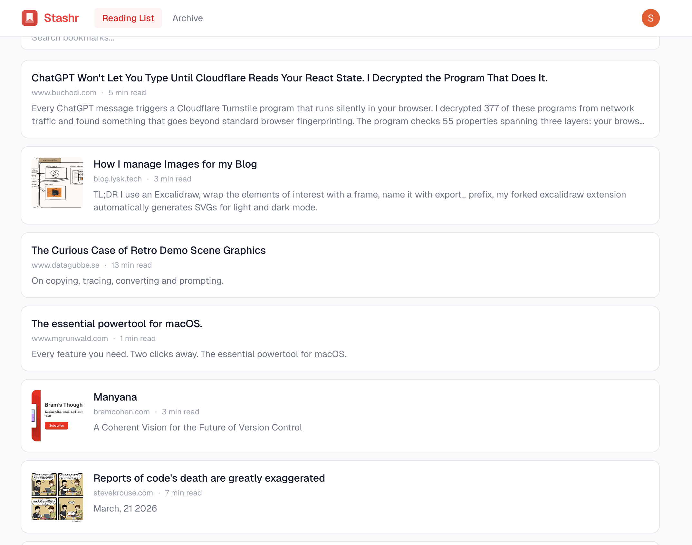
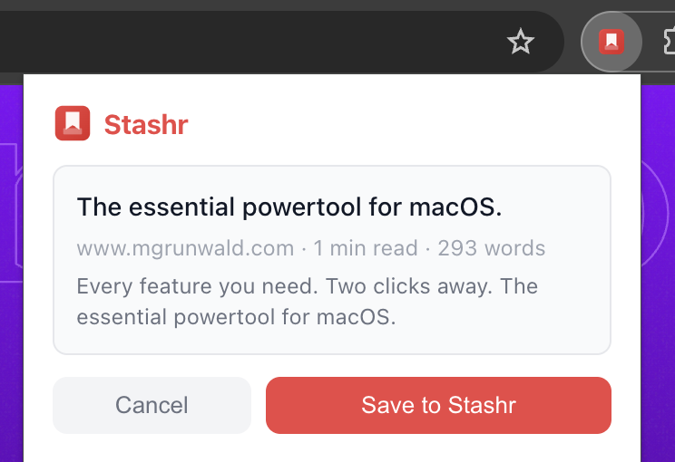

<p align="center">
  
</p>

<h3 align="center">Self-hosted Pocket alternative.<br/>Save articles, read later, own your data.</h3>

<p align="center">
  <a href="LICENSE"></a>
  
  
  
</p>

---

I built StashR after Pocket shut down and I couldn't find an alternative I was happy with. Honestly, I'm still not fully happy with StashR either — it's very much a work in progress. But it scratches the itch: save articles, read them later, own your data.

StashR is a self-hosted read-it-later app. A Chrome extension saves articles with one click, a Fastify API stores metadata in PostgreSQL and article HTML in S3-compatible storage, and a Next.js web app lets you search, organize, and read your saved articles in a clean, distraction-free view. It's primarily meant to be self-hosted — one-click deploy to platforms like Railway is planned but not there yet.

No tracking. No ads. No vendor lock-in. Your articles, on your infrastructure.

<p align="center">
  
</p>

<p align="center">
  
</p>

## Features

- **One-click save** — Chrome extension parses articles in-browser using [Readability.js](https://github.com/mozilla/readability) and sends cleaned HTML to the API
- **Distraction-free reader** — read saved articles in a clean typography-focused view
- **Search** — find articles by title
- **Tags** — organize articles with tags, filter your library
- **Archive** — move articles out of your reading list without deleting them
- **Read tracking** — articles are automatically marked as read when you open them
- **Multi-user** — Clerk authentication, each user has their own library
- **S3-compatible storage** — MinIO for local dev, Cloudflare R2 or AWS S3 in production
- **Fully Dockerized** — PostgreSQL, MinIO, and the API run in Docker; one command to start

## Architecture

```
Browser Extension                 Web App
(WXT + React + Readability.js)    (Next.js 16)
        │                              │
        └──────── Fastify API ─────────┘
                     │
              ┌──────┴──────┐
          PostgreSQL     S3 Storage
          (metadata)   (article HTML)
```

### Monorepo layout

```
stashr/
├── apps/
│   ├── web/            # Next.js reader app
│   └── extension/      # Chrome extension (MV3)
├── services/
│   └── api/            # Fastify API
├── packages/
│   └── db/             # Drizzle ORM schema + migrations
└── docker-compose.yml
```

## Quick Start

See **[docs/quick-start.md](docs/quick-start.md)** for full setup instructions.

```bash
# Clone and install
git clone https://github.com/shadowlanes/stashr.git
cd stashr && pnpm install

# Start backend (Postgres + MinIO + API)
docker compose up

# Run database migrations
pnpm db:migrate

# Start the web app
pnpm dev:web
```

Then load the Chrome extension from `apps/extension/.output/chrome-mv3/` as an unpacked extension.

## Tech Stack

| Layer | Tech |
|-------|------|
| Web app | Next.js 16, React 19, Tailwind CSS |
| Browser extension | WXT, React 18, Readability.js |
| API | Fastify 5, TypeScript, Zod |
| Database | PostgreSQL 16, Drizzle ORM |
| Object storage | MinIO (local) / Cloudflare R2 (prod) |
| Auth | Clerk |
| Monorepo | pnpm workspaces |

## Roadmap

See **[docs/todo.md](docs/todo.md)** for planned features and known issues.

## Contributing

Contributions are welcome! Fork the repo, create a branch, and open a pull request.

## License

[MIT](LICENSE)
